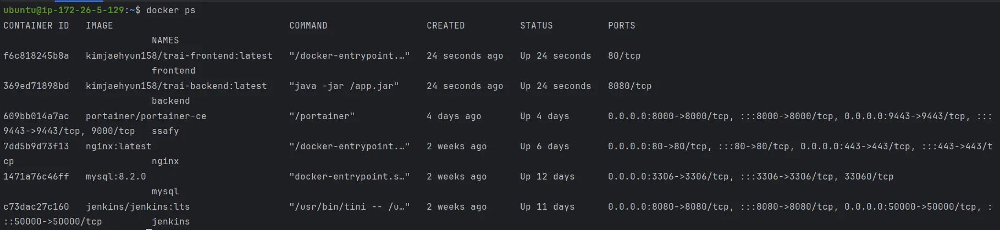

### 1. [사용 도구]

---

- 이슈 관리 : Jira
- 형상 관리 : GitLab
- 커뮤니케이션 : Notion, MatterMost
- CI/CD : Docker, Jenkins, Nginx, Prometheus, Grafana

### 2. [개발 도구]

---

- Visual Studio Code : 1.90.2
- Intellij : 2024.2.3 (Ultimate Edition)

### 3. [개발 환경]

---

### Frontend

| Node.js | 18.20.4 |
| --- | --- |
| React | 18.3.1 |
| Redux Toolkit | 2.3.0 |
| React Router DOM | 6.27.0 |
| Styled Components | 6.1.13 |
| TailwindCSS | 3.4.14 |
| Vite | 5.4.9 |
| three.js | 0.170.0 |

### Backend

| Java | openjdk version 17.0.2 |
| --- | --- |
| Spring Boot | 3.3.4 |
| MySQL | 8.2.0 |
| JWT | 4.4.0 |
| Gson | 2.11.0 |
| WebFlux | 6.1.13 |
| Security | 6.3.3 |

### AI

| LangChain | 0.3.7 |
| --- | --- |
| LangGraph | 0.2.45 |
| LangSmith | 0.1.139 |
| FastAPI | 0.115.4 |
| Selenium | 4.26.1 |

### Server

| AWS EC2 | t2.xlarge |
| --- | --- |
| AWS EC2(AI서버) | c6g.2xlarge |

CPU : 4 / 8

RAM : 16GB

OS : Ubuntu

### Service

| Ubuntu | Ubuntu 20.04.6 LTS |
| --- | --- |
| Ubuntu(AI서버) | Ubuntu 22.04.5 LTS |
| Docker | 27.3.1 |
| Jenkins | 2.462.3 |
| Nginx | 1.18.0 |
| Prometheus | 2.55.0 |
| Grafana | 11.3.0 |
| NodeExporter | 1.7.0 |

### 4. [환경변수 형태]

---

- Backend
    - application-prod.yml
    
    ```java
    server:
      servlet:
        session:
          timeout: 12h
    
    spring:
      application:
        name: trade-ai
      jwt:
        secret: asdnjkansjdknajksndjkansjkdnqeojrdiuwejnadscmsadnfjhbwakjfdlmscjauwfjnkasndjansdjkanskjdbnkj1u823y127hurbhnj423874721yh3iukj
      datasource:
        driver-class-name: com.mysql.cj.jdbc.Driver
        url: jdbc:mysql://${SERVER_IP}:3306/${MYSQL_DATABASE}?serverTimezone=Asia/Seoul&characterEncoding=UTF-8&useUnicode=true
        username: ${MYSQL_USER}
        password: ${MYSQL_PASSWORD}
        hikari:
          maximum-pool-size: 8        # CPU 코어 수 * 2
          minimum-idle: 4             # maximum-pool-size의 절반
          connection-timeout: 20000   # 20초
          idle-timeout: 300000        # 5분
          max-lifetime: 1200000       # 20분
          leak-detection-threshold: 30000  # 30초 - 커넥션 누수 감지
      jpa:
        database: mysql
        database-platform: org.hibernate.dialect.MySQL8Dialect
        hibernate:
          ddl-auto: none
        defer-datasource-initialization: true
        generate-ddl: true
        show-sql: false
        properties:
          hibernate:
            format_sql: true
      sql:
        init:
          mode: never
          data-locations: "classpath:db/data.sql"
    
    logging:
      level:
        root: info
        org.hibernate.SQL: info
        org.springframework.security: info
        com.zaxxer.hikari: warn      # HikariCP 로깅 추가
        com.zaxxer.hikari.HikariConfig: warn
    
    springdoc:
      swagger-ui:
        path: /api/swagger-ui.html
        disable-swagger-default-url: true
      api-docs:
        path: /api/v3/api-docs
    
    ```
    

- frontend
    - .env
    
    ```jsx
    VITE_BASE_URL='https://www.trai-ai.site'
    ```
    

- AI
    - .env
        - OPENAI의 API 키 (LLM 모델 사용)
        - SerpAPI의 API 키 (뉴스 검색 에이전트 기능)
        - LangSmith의 API 키 (LangChain 디버깅 툴)
    
    ```java
    OPENAI_API_KEY=sk-...
    SERPAPI_API_KEY=25...
    LANGCHAIN_TRACING_V2=true
    LANGCHAIN_ENDPOINT=https://api.smith.langchain.com
    LANGCHAIN_API_KEY=lsv2_...
    LANGCHAIN_PROJECT=...
    ```
    

### 5. [CI/CD 구축]

---

- EC2
- Docker
    - 포트번호
    
    
    
- Jenkins
    
    ```java
    pipeline {
        agent any
        options {
            disableConcurrentBuilds(abortPrevious: true)
        }
        environment {
            DOCKER_HUB_CREDENTIALS_ID = 'dockerhub-access-jaehyun'             
        }
    
        stages {
            stage('Clone Repository') {
                steps {
                    script {
                        echo 'Cloning Repository...'
                        git url: 'https://lab.ssafy.com/s11-final/S11P31A609.git', branch: 'develop', credentialsId: 'gitlab-access-jaehyun'
                        echo 'Repository Clone Success!'
                    }
                }
            }
    
            stage('Build Backend') {
                steps {
                    dir('BE') {
                        script {
                            echo 'Building Backend Application...'
                            sh './gradlew clean build -x test'
                            echo 'Backend Application Build Success!'
    
                            echo 'Building Backend Image...'
                            sh 'docker build -t kimjaehyun158/trai-backend:latest .'
                            echo 'Backend Image Build Success!'
                        }
                    }
                }
            }
    
            stage('Build Frontend') {
                steps {
                    dir('FE/trai') {
                        script {
                            echo 'Building Frontend Image...'
                            withCredentials([file(credentialsId: 'front-env', variable: 'VITE_ENV_FILE')]) {
                                sh 'docker build --build-arg VITE_ENV_FILE="$(cat $VITE_ENV_FILE)" -t kimjaehyun158/trai-frontend:latest .'
                            }
                            echo 'Frontend Image Build Success!'
                        }
                    }
                }
            }
    
            stage('Push Images to Docker Hub') {
                steps {
                    script {
                        echo 'Logging in to Docker Hub...'
                        withCredentials([usernamePassword(credentialsId: DOCKER_HUB_CREDENTIALS_ID, usernameVariable: 'DOCKER_HUB_USERNAME', passwordVariable: 'DOCKER_HUB_PASSWORD')]) {
                            sh 'echo "${DOCKER_HUB_PASSWORD}" | docker login -u "${DOCKER_HUB_USERNAME}" --password-stdin'
                        }
                        
                        echo 'Pushing Images to Docker Hub...'
                        sh '''
                            docker push kimjaehyun158/trai-backend:latest
                            docker push kimjaehyun158/trai-frontend:latest
                        '''
                        echo 'Images Push Success!'
                    }
                }
            }
    
            stage('Deploy with Docker Compose') {
                steps {
                    script {
                        echo 'Deploying with Docker Compose...'
                        
                        withCredentials([
                            string(credentialsId: 'mysql-database', variable: 'MYSQL_DATABASE'),
                            string(credentialsId: 'mysql-user', variable: 'MYSQL_USER'),
                            string(credentialsId: 'mysql-password', variable: 'MYSQL_PASSWORD'),
                            string(credentialsId: 'server-ip', variable: 'SERVER_IP')
                        ]) {
                            sh '''
                                docker compose pull
                                docker compose down
                                MYSQL_DATABASE=${MYSQL_DATABASE} \
                                MYSQL_USER=${MYSQL_USER} \
                                MYSQL_PASSWORD=${MYSQL_PASSWORD} \
                                SERVER_IP=${SERVER_IP} \
                                docker compose up -d
                            '''
                        }
                    
                        sh 'docker image prune -f'
                        sh 'docker logout'
                        echo 'Deploy Success!'
                    }
                }
            }
        }
    
        post {
           success {
                script {
                    def Author_Name = sh(script: "git show -s --pretty=%an", returnStdout: true).trim()
                    def Author_Email = sh(script: "git show -s --pretty=%ae", returnStdout: true).trim()
                    def Commit_Message = sh(script: "git log -1 --pretty=%B", returnStdout: true).trim()
                    def Commit_SHA = sh(script: "git rev-parse HEAD", returnStdout: true).trim()
                    def GitLab_URL = "https://lab.ssafy.com/s11-final/S11P31A609/-/commit/${Commit_SHA}"
                    
                    withCredentials([string(credentialsId: 'mattermost-webhook-url', variable: 'WEBHOOK_URL')]) {
                        mattermostSend(
                            color: 'good',
                            message: "✅ Build Success!\n${env.JOB_NAME} #${env.BUILD_NUMBER} by ${Author_Name}(${Author_Email})\n${Commit_Message}\n[GitLab](${GitLab_URL}) [Jenkins](${env.BUILD_URL})",
                            endpoint: WEBHOOK_URL,
                            channel: 'A609-Jenkins'
                        )
                    }
                    echo 'All Completed Successfully!'
                }
            }
            failure {
                script {
                    def Author_Name = sh(script: "git show -s --pretty=%an", returnStdout: true).trim()
                    def Author_Email = sh(script: "git show -s --pretty=%ae", returnStdout: true).trim()
                    def Commit_Message = sh(script: "git log -1 --pretty=%B", returnStdout: true).trim() 
                    def Commit_SHA = sh(script: "git rev-parse HEAD", returnStdout: true).trim()
                    def GitLab_URL = "https://lab.ssafy.com/s11-final/S11P31A609/-/commit/${Commit_SHA}"
                    
                    withCredentials([string(credentialsId: 'mattermost-webhook-url', variable: 'WEBHOOK_URL')]) {
                        mattermostSend(
                            color: 'danger',
                            message: "❌ Build Failed!\n${env.JOB_NAME} #${env.BUILD_NUMBER} by ${Author_Name}(${Author_Email})\n${Commit_Message}\n[GitLab](${GitLab_URL}) [Jenkins](${env.BUILD_URL})",
                            endpoint: WEBHOOK_URL,
                            channel: 'A609-Jenkins'
                        )
                    }
                }
            }
        }
    }
    ```
    

### 6. [빌드 및 실행]

---

- Frontend 실행
    
    ```jsx
    docker build -t kimjaehyun158/trai-frontend:latest .
    docker compose down
    docker compose pull
    docker compose up -d
    ```
    
- Backend 실행
    
    ```bash
    ./gradlew clean build -x test
    docker build -t kimjaehyun158/trai-backend:latest .
    docker compose down
    docker compose pull
    docker compose up -d
    ```
    
- AI 실행
1. 파이어폭스 로컬 설치
2. docker 실행

```
cd ./AI/fastapi
docker-compose -f docker-compose-ai.yml up --build -d
```

### Deploy

```bash
withCredentials([
	    string(credentialsId: 'mysql-database', variable: 'MYSQL_DATABASE'),
	    string(credentialsId: 'mysql-user', variable: 'MYSQL_USER'),
	    string(credentialsId: 'mysql-password', variable: 'MYSQL_PASSWORD'),
	    string(credentialsId: 'server-ip', variable: 'SERVER_IP')
	]) {
	    sh '''
	        docker compose pull
	        docker compose down
	        MYSQL_DATABASE=${MYSQL_DATABASE} \
	        MYSQL_USER=${MYSQL_USER} \
	        MYSQL_PASSWORD=${MYSQL_PASSWORD} \
	        SERVER_IP=${SERVER_IP} \
	        docker compose up -d
	    '''
}
```

- **배포환경 주소**

```
https://www.trai-ai.site
```